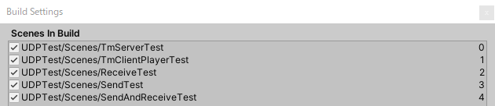
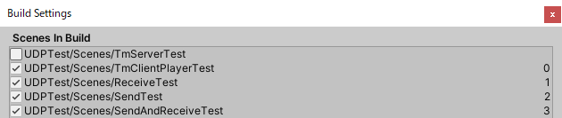
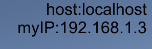
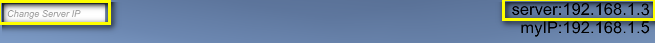
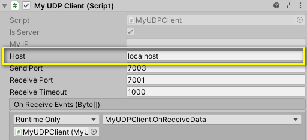

# MyUDPTest  
# https://github.com/misawa2048/MyUDPTest/blob/master/README.md
UDP send and receive module  
HOW TO USE  
- Build server  
    
- Build Client  
    
- Run server  
  The server port can be changed from the command line  
  MyUDPTest.exe -sendPort=8001 -receivePort=8003  
- Run client  
- change server IP on client same as server  
    
  In the example above, 192.168.1.3 or 192.168.1.3:7001:7003 .  
    
- If you want to change server IP from script, change TmUDPClient.host from script.  
    

[https://youtu.be/uScpPz1SkC8](https://www.youtube.com/watch?v=uScpPz1SkC8)
